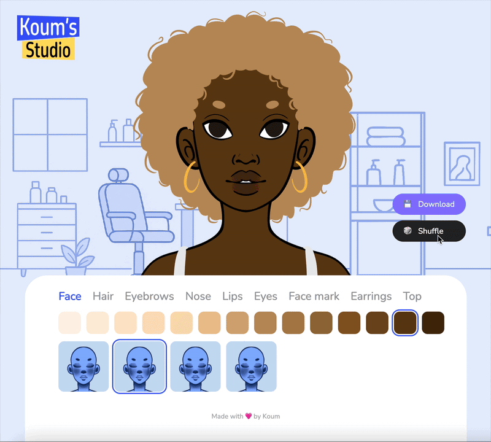

# Koum's Studio ✨

## What is it?

Koum's Studio is a personal project built with ReactJS, combining my coding, drawing, and UI/UX skills.

In this app, you can create and personalize your own avatar using a wide range of hairstyles, eye shapes, nose shapes, and much more, allowing you to generate over 2.6 trillion unique versions to create a truly one-of-a-kind avatar!

## Features

...

## Demo

Try Koum's Studio for yourself! Create and customize your own avatar directly in your browser and see all the features in action.

[Try the demo 👉](https://koums-studio.vercel.app/)

## What's next?

...

Made with 🩷 by Koum 👩🏾‍💻
