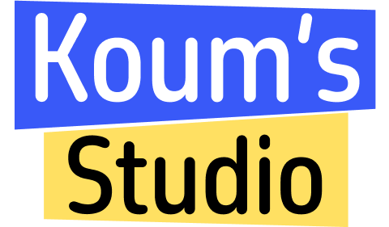
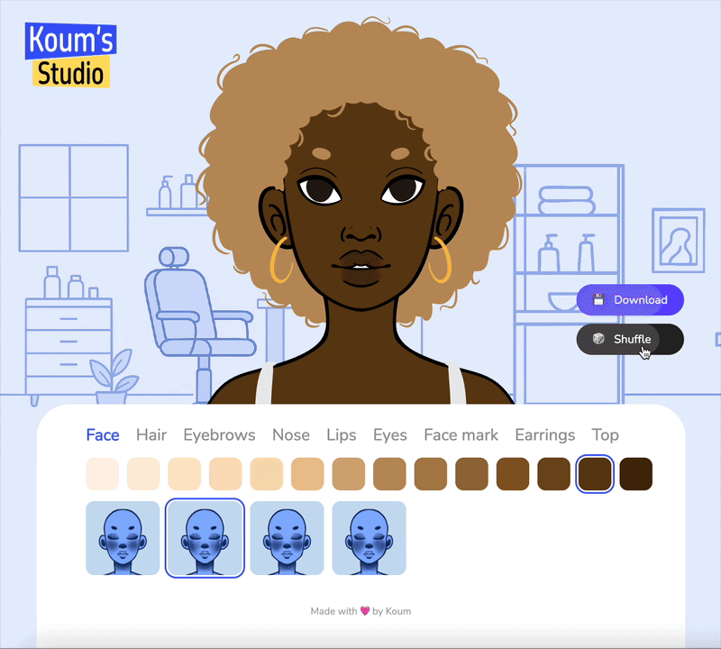

# Koum's Studio ✨

## What is it?

Koum's Studio is a personal project built with [ReactJS](https://react.dev/), combining my coding, drawing, and UI/UX skills.

In this app, you can create and personalize your own avatar using a wide range of hairstyles, eye shapes, nose shapes, and much more, allowing you to generate over 2.6 trillion unique versions to create a truly one-of-a-kind avatar!

## Features

- ✅ Create and fully customize your own avatar

- ✅ Choose from various face shapes, hairstyles, eyes, eyebrows, noses, lips, accessories and clothing

- ✅ Select colors for skin, hair, eyes, lips, accessories, and clothing

- ✅ Real-time preview of all changes

- ✅ Export your avatar as an image

- ✅ Over 2.6 trillion possible combinations

## Demo

Try Koum's Studio for yourself! Create and customize your own avatar directly in your browser and see all the features in action.

[Try the demo 👉](https://koums-studio.vercel.app/)

## What's next?

More components and items are coming soon, including the ability to create a male avatar!

Made with 🩷 by Koum 👩🏾‍💻
